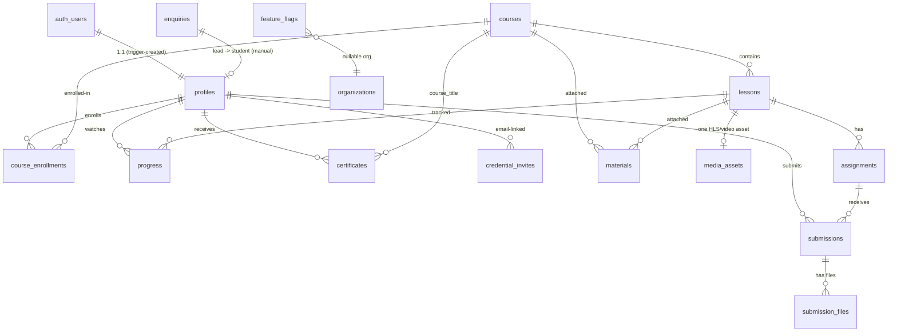

# VIBHA School of Psychology — PLMS System Map

> A living reference for the whole system. Grounded in the code; every claim cites a file.
> Repo root: `plms` (Next.js 16 App Router). Product: **VIBHA School of Psychology** — a clinical-psychology training LMS.

---

## 1. Product overview

**VIBHA School of Psychology** (brand constant in `src/lib/brand.ts`) is an invitation-only training programme for **Cohort One** (start date `2026-08-20`). It closes the gap between *describing* therapy and *practising* it: real cases, simulated patients, timed assessments, and a debrief after every session.

There are two distinct surfaces sharing one codebase:

| Surface | Audience | Notes |
|---|---|---|
| **Public marketing site** | Anonymous visitors | `/`, `/waitlist`, `/policies/*`, `/verify/[certificateId]`. Indexable, conversion-focused. |
| **The app (LMS)** | Authenticated users | Everything under `(dashboard)` — noindexed (`robots: index:false` in `src/app/(dashboard)/layout.tsx`). |

**Who logs in** (from `src/lib/auth/session.ts`, `Profile` type):

- **Admin** — `role: "admin"`. Runs the school: courses, roster, grading, flags, practice review.
- **Student** — `role: "student"`. Two access axes:
  - **`scope`** — `full` (default) or `lectures_only`. `lectures_only` locks the account to the lecture list (`/dashboard`) + player (`/courses/*`) only — every other surface is blocked server-side (`src/lib/auth/scope.ts`).
  - **`status`** — `active` (default) or `blocked`. `blocked` is an *unconditional* override: rejected on every request regardless of password/session validity; redirects to `/paused`.
- **Alumni** — `role: "alumni"`. Permanent read-only access to their own record (`src/lib/auth/guards.ts`).

There is **no public sign-up** — all accounts are created by the admin via the roster import (`src/lib/auth/roster.ts`), so `auth.users` has no public INSERT path (`supabase/schema.sql`).

---

## 2. Tech stack

From `package.json` (versions as pinned there):

| Layer | Choice | Version |
|---|---|---|
| Framework | **Next.js** (App Router, Turbopack) | `^16.3.1` |
| UI | **React** | `19.2.4` (`react-dom` `19.2.4`) |
| Database + Auth + Storage | **Supabase** | `@supabase/supabase-js` `^2.111.0`, `@supabase/ssr` `^0.12.4` |
| Canonical video/HLS store | **Cloudflare R2** (S3-compatible) | `@aws-sdk/client-s3` `^3.1101.0` |
| Transactional email | **Resend** | direct `fetch` to `https://api.resend.com/emails` (`src/lib/auth/roster.ts`) |
| Hosting | **Vercel** | `vercel.json` pins region `bom1` (Mumbai) |
| Styling | **Tailwind CSS** v4 | `tailwindcss` `^4`, `@tailwindcss/postcss` `^4` |
| Motion | **motion** (`framer-motion`) | `^12.43.0` |
| Video playback | **hls.js** | `^1.6.16` |
| Spaced repetition | **ts-fsrs** | `^5.4.1` |
| Forms / validation | **react-hook-form** + **zod** | `^7.84.0` / `^4.4.3` |
| PDF render / generate | **pdfjs-dist** / **pdf-lib** | `^6.2.108` / `^1.17.1` |
| Realtime voice | **LiveKit** | `livekit-client` `^2.21.0`, `livekit-server-sdk` `^2.17.0`, `@livekit/agents` `^1.6.4` |
| Observability | **Sentry** `@sentry/nextjs` `^10.69.0`; **PostHog** `posthog-js` `^1.417.0`; **Vercel Analytics/Speed Insights** | |
| Local ML | **@huggingface/transformers** | `^4.2.0` |
| UI primitives | **radix-ui** `^1.6.7`, **lucide-react** `^1.28.0`, **cva/clsx/tailwind-merge**, **next-themes**, **sonner**, **cmdk** | |
| MDX (policies) | **next-mdx-remote**, **remark-gfm**, **gray-matter** | |
| Tests | **Vitest** `^4.1.10`, **Playwright** `^1.62.1` | |

**Note on Next.js 16 breaking changes** (`AGENTS.md`): this is not the Next.js you know — APIs/conventions differ. The middleware layer is renamed to a **proxy** (`src/proxy.ts`) with a deliberately narrowed, "thin" contract. Relevant guides live in `node_modules/next/dist/docs/`.

---

## 3. Route map

Routes are real `page.tsx`/`route.ts` files under `src/app` (App Router). Grouped below.

### 3.1 Public (marketing + status)

```
/                                 → landing (src/app/page.tsx) — serves markdown to agents via Accept header (proxy.ts)
/enquire                          → 302 redirect to /waitlist (next.config.ts redirects, not a page)
/waitlist                         → lead form (src/app/waitlist/page.tsx + actions.ts; inserts into enquiries)
/login                            → (src/app/login/page.tsx)
/set-password                     → (src/app/set-password/page.tsx)
/policies                         → policy index (src/app/policies/page.tsx)
/policies/[slug]                  → dynamic policy page (content/policies/*.md)
/verify/[certificateId]           → public certificate proof page (src/app/verify/[certificateId]/page.tsx)
/paused                           → blocked-account screen (src/app/paused/page.tsx)
/expired                          → expired-session screen (src/app/expired/page.tsx)
/.well-known/agent-card.json      → route handler (RFC agent discovery)
/.well-known/api-catalog          → route handler (RFC 9727 API catalog)
/.well-known/oauth-protected-resource → route handler
/openapi.json                     → static OpenAPI doc
/auth.md                          → agent registration markdown
/sitemap.ts                       → public URLs (/, /waitlist, /policies/*)
```

Permanent redirects (`next.config.ts`): `/privacy`, `/privacy-policy` → `/policies/privacy`; `/terms`, `/terms-and-conditions` → `/policies/terms`; `/refund-policy` → `/policies/refund`.

### 3.2 Student — `(dashboard)` group

All wrapped by `src/app/(dashboard)/layout.tsx` (auth + scope + blocked + mode shell). Student nav shell vs admin shell is `role`-driven.

```
/dashboard                                   → lecture list (course/lesson browse)
/today                                       → "One thing next" + streak (daily plan)
/courses/[courseId]                          → course overview / lesson list (CourseOverview component)
/courses/[courseId]/lessons/[lessonId]       → lesson player (video + assignment)
/courses/[courseId]/materials/[materialId]   → material viewer (pdf/audio/image/link)
/reflect                                     → "Your journal" (journal surface)
/record                                      → "The paper trail of your training"
/wall                                        → shared cohort wall
/notifications                               → wall replies + reports to review
/passport                                    → "Your competencies, evidenced"
/settings                                    → account settings
/tools/psychopharm                           → drug reference browser
/tools/psychopharm/[drug]                    → drug detail
/tools/psychopharm/compare                   → drug comparison
/tools/psychopharm/learn                     → learning mode
```

### 3.3 Practice tools — `/practice/*`

The practice hub (`src/app/(dashboard)/practice/page.tsx`) lists 19 tools; each is gated by a feature flag (see §8) via `requireFeature()` which redirects to `/practice/not-available` when off.

```
/practice                                      → hub grid
/practice/consulting-room                      → "Consulting Room" (simulated patient interview)
/practice/consulting-room/session/[sessionId]  → live/review session
/practice/decode                               → "Presenting Complaint Decoder"
/practice/mse                                  → "MSE Trainer"
/practice/judgment                             → "5 Judgment Calls"
/practice/rounds                               → "Rounds" (spaced-repetition cards, ts-fsrs)
/practice/two-minute-clinic                    → "Two-Minute Clinic"
/practice/formulation                          → "Formulation Forge"
/practice/osce                                 → "OSCE Stations"
/practice/ethics                               → "Ethics & Law"
/practice/landmark                             → "Landmark Cases"
/practice/out-of-depth                         → "Out of Depth" (refer/escalate)
/practice/role-play                            → "Peer Role-Play"
/practice/library                              → "Case Library"
/practice/tutor                                → "Psychology Tutor" (knowledge-grounded Q&A)
/practice/supervision                          → "Supervision Log"
/practice/weak-spots                           → "Weak Spots"
/practice/check-in                             → "Weekly Check-in"
/practice/modules                              → "Modules"
/practice/passport                             → skills passport (practice view)
/practice/not-available                        → honest "not yet available" gate target
```

### 3.4 Admin — `(dashboard)/admin/*`

Gated by `src/app/(dashboard)/admin/layout.tsx` (server-side `role === "admin"`). Admin overview (`/admin`) shows "Needs attention" (grade submissions, review sessions, quiet students, welcome new students) + a programme snapshot + DB-size warning.

```
/admin                                    → overview
/admin/courses                            → course builder (list)
/admin/courses/[courseId]                 → course editor
/admin/roster                             → credential password list (reveal/copy/reset/CSV/email/lock)
/admin/students                           → student list + bulk import
/admin/submissions                        → grade submissions
/admin/tools                              → bulk import form + cohort calendar
/admin/flags                              → feature-flag toggles
/admin/enquiries                          → waitlist leads
/admin/pulse                              → cohort-pulse nudge (quiet-student emails)
/admin/triage                             → flagged sim-session review
/admin/sim-review                         → sim session review
/admin/supervision                        → supervision sign-off
/admin/wall-reports                       → reported wall posts
/admin/calibration                        → rubric calibration (human vs AI scoring)
/admin/cards                              → study-cards review queue
/admin/checkins                           → weekly check-ins
/admin/idioms                             → idiom bank
/admin/modules                            → module management
/admin/infra                              → infra / usage metrics
/admin/corpus/dictate                     → corpus dictation
/admin/psychopharm                        → psychopharm KMS editor
/admin/psychopharm/editor                 → editor
/admin/psychopharm/editor/[drug]          → per-drug editor
/admin/psychopharm-review                 → review queue
/admin/psychopharm-review/[table]         → per-table review
```

**Dynamic vs static**: the whole `(dashboard)` tree is effectively dynamic (reads cookies/auth via `getSession`). `force-dynamic` is set explicitly on `/admin/flags` and `/admin/roster`. Public pages (`/`, `/waitlist`, `/policies/*`, `/verify/*`) are server-rendered and (except `/verify`, which is `robots:noindex`) indexable.

### 3.5 API routes (route handlers under `src/app/api`)

```
/api/health                         → service health
/api/cohort-calendar                → generate session schedule
/api/internal/cron                  → GitHub Actions cron (CRON_SECRET bearer)
/api/livekit/token                  → LiveKit access token
/api/media/playback                 → POST { lessonId } → mint stream token (see §6)
/api/media/stream/[...lessonId]     → GET stream proxy (playlist/segment/__key__) (see §6)
/api/media/materials/[materialId]   → signed material URL
/api/media/submissions/[...fileId]  → signed submission-file URL
/api/knowledge/{ask,search,concepts}→ knowledge base Q&A / search
/api/psychopharm/{search,document,bands,review} → psychopharm KMS
/api/sim/health                     → sim engine health
/api/admin/{calibration,cards,flags,idioms,modules,nudge,sim-corrections,supervision-signoff,wall-reports}
/api/practice/*                     → per-tool endpoints: chain, checkin, clinic(+complete), competency, corpus/dictate(+turn/complete), formulation(+attempt/wall), idioms, journal(+help/share), library(+note), mse(+attempt/stimuli/transcripts), osce(+attempt), passport(+pdf), quiz(+attempt), roleplay(+session/message/messages), rounds(+review), sct(+attempt), sim(+session/turn/debrief/rewind), supervision(+signoff), voice(+stt/synthesis), wall(+pin/reaction/reply/report)
```

---

## 4. Auth & access model

Two cookies are the whole session story:

- **`sb-<ref>-auth-token`** — the Supabase Auth session (managed by `@supabase/ssr`).
- **`plms_session`** — an app-level `active_session_token` (a UUID) stamped on the profile at login and matched on every request, to enforce **single active session** (logging in elsewhere invalidates the previous browser).

**Layers** (all three re-check per request):

1. **`src/proxy.ts`** (Next.js 16's middleware replacement) — a *thin proxy*. Refreshes the Supabase auth token, and bounces anyone with no user at all away from `/dashboard`, `/admin`, `/courses`. Deliberately does **no** DB work. Also sets `x-pathname` for downstream layout scope checks, and serves markdown for `Accept: text/markdown` on `/`.
2. **`getSession()` in `src/lib/auth/session.ts`** — the authoritative check, wrapped in React `cache()`. Order of verdicts:
   1. no Supabase user → `unauthenticated`
   2. no `profiles` row → sign out, `unauthenticated` (fail closed)
   3. `status === "blocked"` → `blocked` (checked **before** expiry/token; does *not* sign out so unblocking restores access next request)
   4. `expires_at` past (non-alumni) → sign out, `expired`
   5. `plms_session` cookie missing/mismatch vs `profiles.active_session_token` → sign out, `session_replaced`
   6. otherwise → `ok`
3. **Layouts** — `src/app/(dashboard)/layout.tsx` maps verdicts to redirects (`expired`→`/expired`, unauthenticated/replaced→`/login`, blocked→`/paused`), then enforces **lecture-only scope** via `lectureOnlyAllowed(pathname)`; `src/app/(dashboard)/admin/layout.tsx` enforces `role === "admin"`.

**Server Actions** use `requireSession()` / `requireAdmin()` (`src/lib/auth/guards.ts`), which route through the full `getSession()` so expired/replaced accounts can't invoke an action directly.

**Two access axes on `profiles`:**
- `scope` ∈ `full` | `lectures_only` (`supabase/migrations_pending/profiles_access_scope.sql`)
- `status` ∈ `active` | `blocked` + internal `block_reason` (`supabase/migrations_pending/profiles_status_blocked.sql`)

---

## 5. Data model

Base schema: `supabase/schema.sql` (core tables + RLS + `on_auth_user_created` trigger). Extensions arrive via `supabase/migrations_pending/*.sql` (the "approved" set) and `src/migrations_pending/*.sql` (the practice-layer/psychopharm set). Project ref: `hojhzwvuccojqkvkkslw` (in `scripts/apply-migrations.ts`).

### Entity-relationship sketch



### Core tables

| Table | Key columns | Purpose |
|---|---|---|
| `profiles` | `id` (pk, fk `auth.users`), `role`, `scope`, `status`, `block_reason`, `active_session_token`, `expires_at`, `is_test` | One row per user; the two access axes live here |
| `courses` | `id`, `title`, `is_published` | Published = visible to enrolled students |
| `course_enrollments` | `user_id`, `course_id`, `enrolled_at`, `policy_acceptance_at`, `policy_version` | Manual per-student enrollment (admin-managed) |
| `lessons` | `id`, `course_id`, `title`, `order_index`, `requires_assignment`, `video_storage_path`, `video_provider`, `video_bucket`, `video_status` | Lesson + where its video lives |
| `media_assets` | `lesson_id` (unique), `provider` (`supabase`/`r2`), `bucket`, `key_prefix`, `master_playlist`, `ladder` (jsonb), `duration_seconds`, `mime_type` | The indirection: where a video lives + in what form (HLS) |
| `progress` | `user_id`, `lesson_id`, `watched_seconds`, `is_completed` | Resume position per viewer |
| `materials` | `course_id`, `lesson_id`, `title`, `kind` (`document`/`slides`/`audio`/`image`/`link`), `storage_path`, `format`, `url`, `provider`, `bucket`, `status` | Course/lesson files + links |
| `assignments` | `lesson_id`, `title`, `instructions`, `due_at`, `allow_late`, `accepted_formats[]`, `max_files`, `max_file_mb`, `is_published`, `submission_type` | Widened from base schema; `submission_type` now a comma list |
| `submissions` | `assignment_id`, `user_id`, `text_content`, `audio_storage_path`, `status` (`pending_review`/`approved`/`returned`), `score`, `feedback`, `is_late`, `returned_at` | Graded work |
| `submission_files` | `submission_id`, `storage_path`, `original_name`, `provider`, `bucket`, `status` | Files attached to a submission |
| `credential_invites` | `email` (unique), `name`, `status` (`pending`/`sent`/`failed`), `password`, `error_reason`, `sent_at` | Roster credential queue (password stored plaintext, admin-only) |
| `certificates` | `user_id`, `course_id`, `student_name`, `course_title`, `issued_at`, `issued_by`, `pdf_storage_path` | Manual sign-off only; powers `/verify/[id]` |
| `enquiries` | `name`, `email`, `phone`, `status`, `message`, `source`, `policy_acceptance_at`, `policy_version` | Public waitlist leads |
| `feature_flags` | `key` (unique), `enabled`, `enabled_for_cohort`, `organization_id` | Practice-tool toggles (see §8) |
| `rate_limits` | `key` (pk), `count`, `reset_at` | Postgres-backed fixed-window rate limiter (global across serverless) |

### Practice / psychopharm / AI tables (grouped, from `src/migrations_pending/*.sql`)

- **Sim / practice**: `sim_sessions`, `sim_scores`, `sim_corrections`, `checkins`, `rubric_dimensions` (+ auto-calibration signals), `cards` (+ `sort_order`), `formulation_attempts`, `mse_attempts`, `mse_stimuli`, `osce_stations`, `sct_items`, `ai_usage_log` (+ `prompt_version`, `used_fallback`, `regenerated`), `ai_response_cache`, `knowledge_concepts`, `knowledge_*`, `idioms`, practice modules/tools/habit/rights tables, `course_weeks`.
- **Psychopharm KMS**: drug/monograph/document/band/observation tables (`supabase/migrations_pending/psychopharm_kms.sql`, `psychopharm_tools.sql`, `psych_drug_classification.sql`).

**RLS posture** (`supabase/schema.sql` Part B + migrations): `is_admin()` SECURITY DEFINER helper; students read/own their own rows; writes are admin-only or own-pending-row only. Storage buckets `videos`, `materials`, `submissions` are **private** with admin-only RLS; student file access is via per-request signed URLs minted server-side after an ownership/enrollment check.

---

## 6. Media / streaming pipeline

The canonical store is **Cloudflare R2**; Supabase Storage is the legacy fallback. Video is delivered as **HLS** (multi-bitrate ladder), streamed through an authenticated proxy, with **per-session AES-128 encryption**.

### End-to-end flow

```
player (hls.js)
  └─ POST /api/media/playback  { lessonId }
        (src/app/api/media/playback/route.ts)
        • same-origin gate (Origin/Referer vs NEXT_PUBLIC_APP_URL) — fail closed
        • requireSession()
        • rate limit (per user 60/min, per IP 120/min)
        • canAccessLesson() → enrollment + publish re-check (admin bypass)
        • mint stream token (HMAC, 5-min TTL, bound to user+lesson+course)
        • returns { token, streamUrl: /api/media/stream/<lessonId>, mediaType: hls|mp4, resumeSeconds }
  └─ GET /api/media/stream/<lessonId>/...?st=<token>
        (src/app/api/media/stream/[...lessonId]/route.ts)
        • verifyStreamToken() + requireSession() (uid must match token)
        • rate-limit (fast, in-memory)
        • authorizeAndResolveLesson() cached per (uid, lessonId) for token life
        • resolves object via resolveLessonStreamFromRow()
        • serves: master/variant .m3u8 (rewritten) | seg_####.ts (encrypted) | __key__ (session key)
```

### Token + crypto (`src/lib/media/stream-token.ts`, `crypto.ts`)

- Token is `base64url(payload).base64url(hmac)` signed with `SESSION_SECRET` (dedicated secret; **never** the service-role key — audit finding #5). TTL 5 min, refreshed by the player.
- Per-session key = `HMAC("plms-session-key-v1:"+lessonId, SESSION_SECRET, streamToken)[0..16]` (16-byte AES-128).
- Each `.ts` segment (stored **plaintext** in R2) is re-encrypted AES-128-CBC on delivery, **IV = media-sequence number** as 16-byte big-endian. The playlist gets a single `#EXT-X-KEY:METHOD=AES-128,URI=…/__key__` line; `__key__` returns the session key to the authorized session. hls.js derives the same IV from `EXT-X-MEDIA-SEQUENCE` + index.
- Honest ceiling: without DRM (Widevine/FairPlay), a determined user can still screen-record.

### Object resolution (`src/lib/media/proxy-client.ts`)

`resolveLessonStreamFromRow(lesson)` reads **recorded** columns only — never infers from `NEXT_PUBLIC_MEDIA_PROVIDER`:
- If `media_assets[0].master_playlist` → HLS (`provider` = `r2`|`supabase`, `bucket` from the row or env default, `key` = `master_playlist`, `keyPrefix` = `key_prefix`).
- Else legacy single-file `video_storage_path` → served byte-for-byte (proxy-gated, no segmentation).

### `media_assets` row contract + ladder naming

`media_assets` (`supabase/migrations_pending/media_assets.sql` + `media_location_status.sql`): `provider`, `bucket`, `key_prefix`, `master_playlist`, `ladder` (jsonb), `duration_seconds`, `mime_type`.

Ladder produced by `scripts/publish-lecture.ts` (`LADDER`): 1080p/720p/480p/240p, ≥1.5× bitrate gap, 6-second segments, `keyint=48` (~2s keyframes). Naming:

```
lessons/<id>/hls/master.m3u8
lessons/<id>/hls/hls_1080/index.m3u8   (variant references seg_0000.ts, seg_0001.ts, …)
lessons/<id>/hls/hls_720/index.m3u8
lessons/<id>/hls/hls_480/index.m3u8
lessons/<id>/hls/hls_240/index.m3u8
```

### Publish + migration scripts

- `npm run publish-lecture -- ./raw/lecture.mp4 --lesson <id>` — ffprobe → ffmpeg HLS ladder → upload to R2 → upsert `media_assets`. Idempotent (overwrite by key) + resumable (skips segments whose size already matches). (`scripts/publish-lecture.ts`)
- `npm run migrate-supabase-to-r2` — finds lessons with `video_storage_path` and no `media_assets`, re-encodes through the same pipeline, uploads to R2, upserts the asset. Does **not** delete Supabase originals. (`scripts/migrate-supabase-to-r2.ts`)
- Supporting: `media-doctor.ts` (verify objects exist/non-zero before `ready`), `media-promote.ts` (flip `pending` → `ready`), `verify-r2.ts`, `rotate-r2.ts`, `set-r2-cors.ts`, `migrate-submissions-to-r2.ts`.

---

## 7. Roster / credential-email flow

Imported via `/admin/tools` (BulkImportForm → server action `admin/students/bulk-import.ts`) or the CLI `npm run roster:import` (`scripts/roster-import.ts`). Both share `src/lib/auth/roster.ts`.

1. **Parse** CSV (`name,email`, header-based, case-insensitive, BOM-stripped, dedupe by email).
2. **Import** (`importRoster`): `admin.auth.admin.createUser({ email, password, email_confirm: true, user_metadata })` — each student gets an **8-char password** (letters+digits, no look-alikes 0/O/1/I/l). Profile scope is stamped on the created row; a `credential_invites` row is upserted `status:'pending'` **with the password stored in plaintext** so Kavya can see/share the whole batch.
3. **Review/share** at `/admin/roster` (`src/app/(dashboard)/admin/roster/page.tsx`): reveal/copy each password, reset (regenerate), download full list as CSV, email a password, and lock/unlock access (profiles.status toggle).
4. **Optional email** (separate, explicit step) via `sendResendEmail()` — the *only* code path to Resend; reads `RESEND_API_KEY`, default from `"VIBHA School of Psychology <noreply@vibhaschoolofpsychology.in>"` (`.env.example` line 89, `roster.ts` line 345). **Deployed override** (Vercel prod `RESEND_FROM_EMAIL`): `"VIBHA School of Psychology <noreply@bindcat.com>"` — the verified sender. The email carries the **password, never a link** — the old password-recovery-link flow was dropped because Supabase Auth's redirect allowlist rejected the target.

**RLS**: `credential_invites` is admin-only (`credential_invites.sql`). The auth-user password is always hashed in Supabase; the plaintext lives only in this admin-only table — an explicit product decision documented in the migration.

---

## 8. Feature flags

- Table: `feature_flags` (`key` unique, `enabled`, `enabled_for_cohort`) — reproduced in `src/migrations_pending/practice_layer_flags.sql`.
- Admin UI: `/admin/flags` (`src/app/(dashboard)/admin/flags/page.tsx`, `flag-toggle.tsx`).
- Read path: `src/lib/flags.ts` — `readFlags()` (30s cache), `isFeatureEnabled()`, and `requireFeature()` which server-side **redirects** to `/practice/not-available` when off (not just hidden UI).
- 19 flags map 1:1 to practice tools; **`knowledge_tutor` is the only one seeded disabled** (all others `true`). The `LIVE_FOR_COHORT_ONE` constant in the flags page still lists the original six-ship cut (`consulting_room`, `decoder`, `mse`, `judgment`, `rounds`, `journal`), but the seed enables the full set.

---

## 9. Deploy & ops

- **Production domain**: `vibhapsychology.com` (`src/app/sitemap.ts`; `NEXT_PUBLIC_APP_URL` must be set to it on Vercel, *not* the internal `bind-lms-platform.vercel.app`). Vercel region: `bom1` (`vercel.json`).
- **Env vars** (`.env.example` is the single source of truth):
  - `NEXT_PUBLIC_APP_URL`, `SESSION_SECRET` (HMAC stream-token/session-key secret; required, no fallback)
  - Supabase: `NEXT_PUBLIC_SUPABASE_URL`, `NEXT_PUBLIC_SUPABASE_ANON_KEY`, `SUPABASE_SERVICE_ROLE_KEY`
  - R2: `CLOUDFLARE_ACCOUNT_ID`, `R2_ACCESS_KEY_ID`, `R2_SECRET_ACCESS_KEY`, `R2_BUCKET_NAME`, `R2_PUBLIC_URL`, `R2_BACKUP_BUCKET`
  - Resend: `RESEND_API_KEY`, `RESEND_FROM_EMAIL`
  - Sentry / PostHog / Turnstile; `CRON_SECRET`, `APP_URL`
  - Voice/TTS lanes (MiMo, Kokoro, Qwen, Chatterbox, NVIDIA NIM, ElevenLabs last-resort)
  - AI router keys + `AI_ENABLED`, `AI_STUDENT_TIER`, `AI_DEBUG`, `AI_FIXTURE_FALLBACK`
- **Migrations**: `npm run apply-migrations` (`scripts/apply-migrations.ts`) applies an explicit **APPROVED list** from `supabase/migrations_pending/` (not "everything in the dir"), tracking idempotency in a `_migrations_applied` ledger, over the Supabase pooler (`db.hojhzwvuccojqkvkkslw.supabase.co`, SNI = direct host).
- **AI provider lanes** (`src/lib/ai/router.ts`): a registry with failover on 429/5xx. `trainsOnData` is the hard data-policy split — **student data may only go to `trainsOnData:false` providers** (`src/lib/ai/guards.ts`). Groq (`llama-3.3-70b-versatile`) is the primary no-train Director/Actor lane; Cerebras/SambaNova/OpenRouter/OpenCode/OmniRoute are no-train fallbacks; Gemini/DeepSeek (`trainsOnData:true`) are excluded from student lanes; Anthropic is optional/paid. `AI_ENABLED=false` → deterministic fixtures in `src/lib/ai/fixtures/` (the whole app still works).
- **Observability**: Sentry (`src/instrumentation.ts`, `sentry.*.config.ts`), PostHog, Vercel Analytics/Speed Insights.

---

## 10. Design system

**"Neo-Brutalist Pastel"** — encoded in `.claude/skills/vibha-design/SKILL.md` (load before any UI work), tokens in `src/app/globals.css`, brand copy in `src/lib/brand.ts`.

- **World**: warm peach/terracotta on soft cream; **2px ink borders**; hard **zero-blur** offset shadows; radii 10px cards / 6px inputs / 999px pills.
- **Color discipline** (load-bearing): peach `--primary` `#f4a261` is a **fill only** (never text-on-cream, ~1.9:1); accent text uses terracotta `--link` `#b83a00` (≥5.4:1). Ink near-black `#1e1e14`. Surfaces `--surface-1`/`--surface-2`/`--background`/`--card`.
- **Type**: Geist sans (body/display), Source Serif 4 italic (exactly one accent phrase per section), Geist Mono (index numerals/eyebrows/stamps).
- **Motion**: minimal, `transform/opacity` only, reduced-motion-safe (controls 120–220ms, entrances 400–600ms out-expo, rubber-stamp one-shot scale).
- **Rules**: WCAG AA+ always; honest copy (no fabricated claims); "caveman UI" plain language; editorial wayfinding with mono index numerals + peach dots.

Shared primitives live in `src/components/design-system/` (`page-header`, `stat-card`), `src/components/ui/` (shadcn/radix-based), and `src/components/motion/reveal.tsx`.

---

*This is a reference doc, not a spec. If a section and the code disagree, the code wins — file paths are cited throughout so the source of truth is one click away.*
